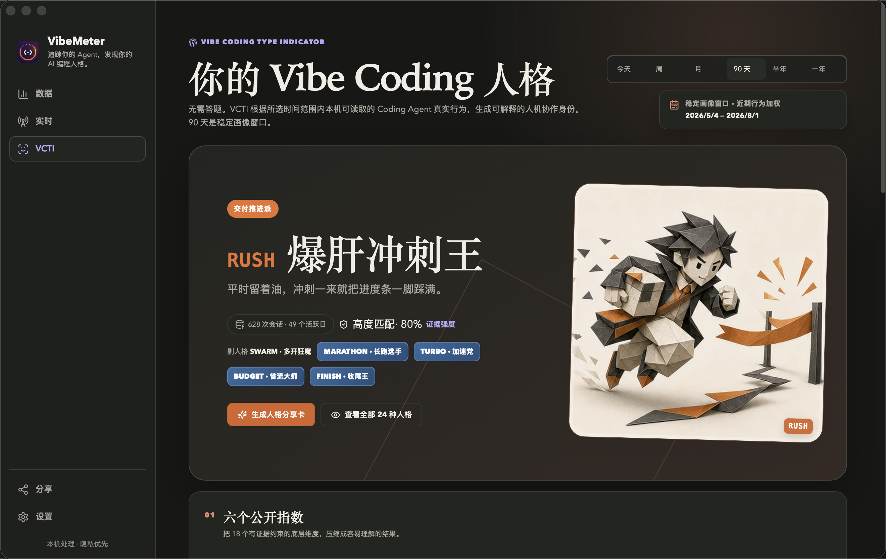
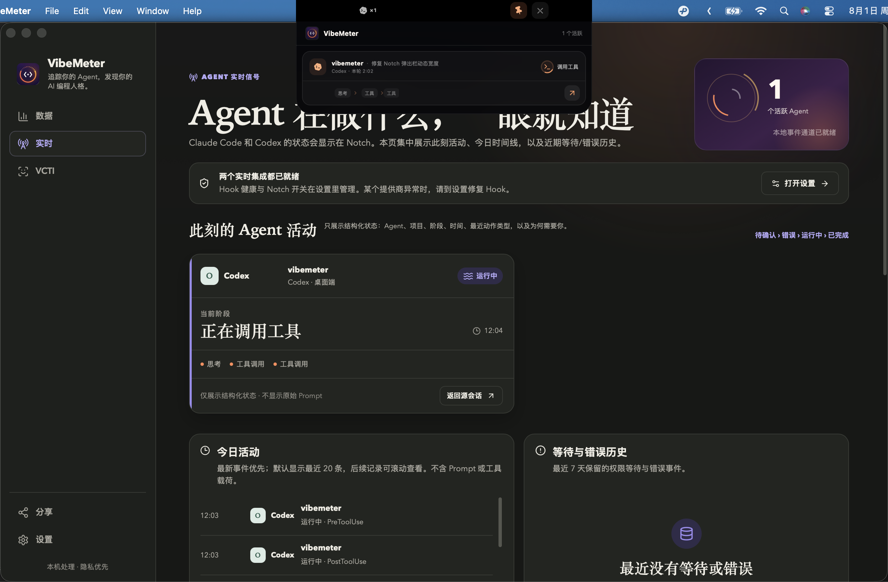
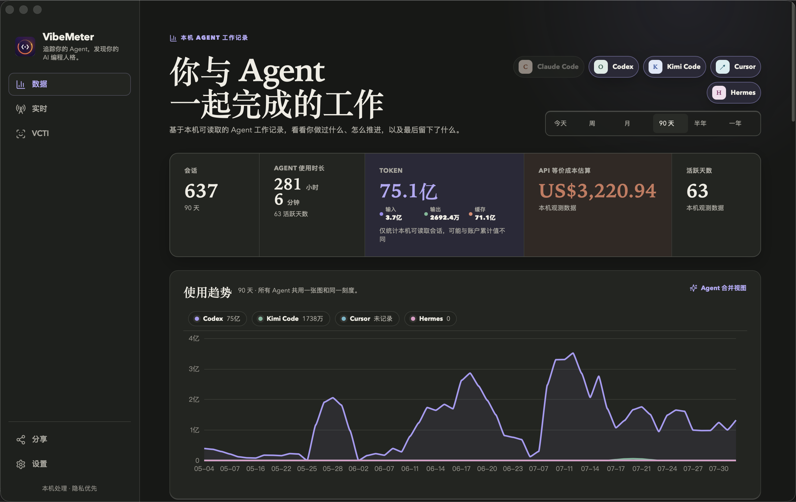
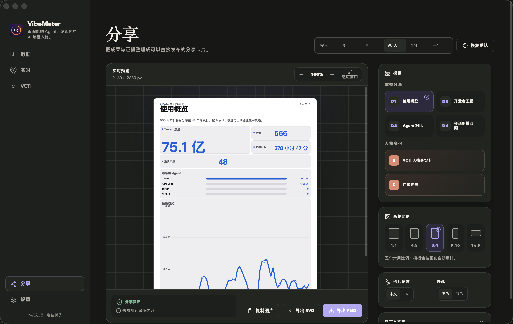
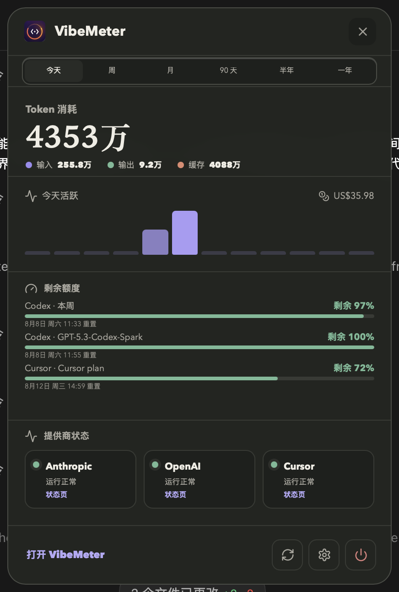
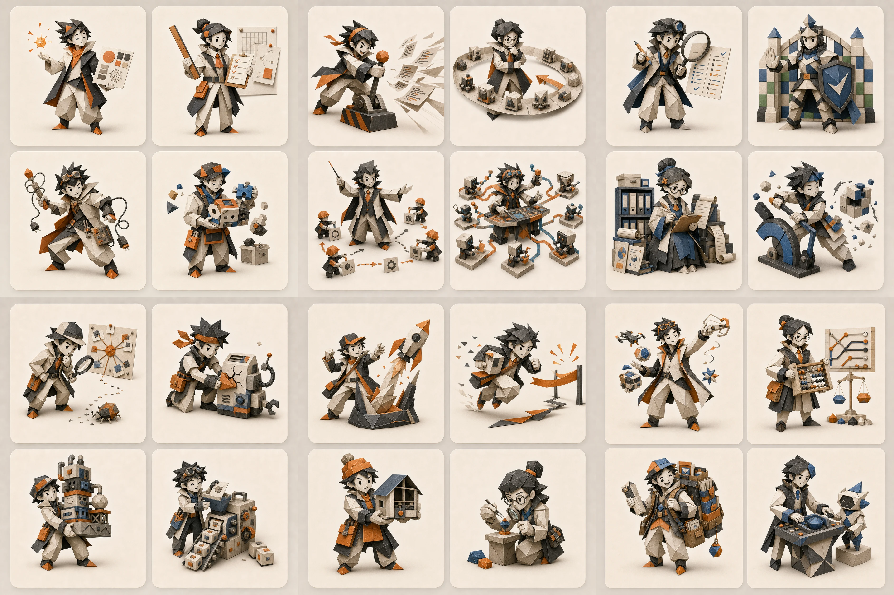
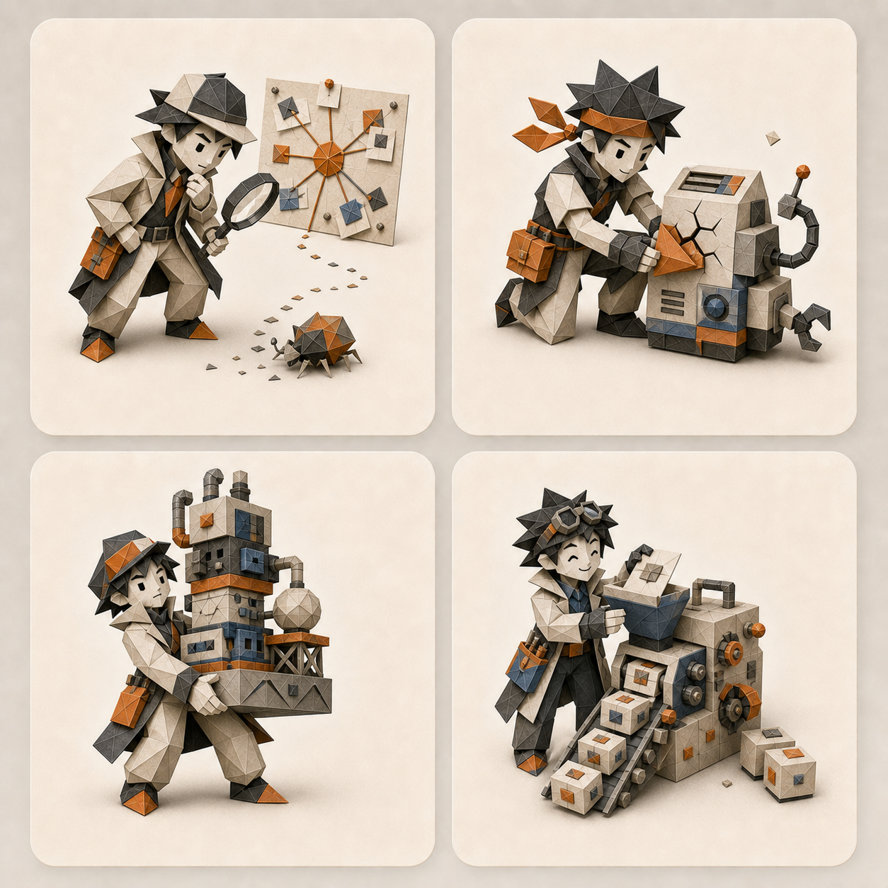

<p align="center">
  
</p>

<h1 align="center">VibeMeter</h1>

<p align="center">
  <strong>Agent 在做什么，一眼就知道。</strong><br>
  追踪你的 Agent，发现你的 AI 编程人格。
</p>

<p align="center">
  <a href="https://github.com/RangeKing/vibemeter/releases"></a>
  <a href="https://github.com/RangeKing/vibemeter/actions/workflows/ci.yml"></a>
  
  
  <a href="LICENSE"></a>
</p>

<p align="center">
  🇨🇳 <strong>中文</strong> · <a href="README_EN.md">🇺🇸 English</a>
</p>

VibeMeter 把实时状态、长期数据和 VCTI 人格装进一款本机优先的 macOS 应用。Claude Code 与 Codex 正在思考、读取、调用工具，还是等你处理，Notch 会及时告诉你；会话、Token、成本、模型、工具与 Skill 使用留在本机，逐渐形成可回看、可分享的数据。证据足够后，24 种 VCTI 人格会给你一份真正属于自己的协作画像。

它不接管 Agent，不替你批准权限，也不改写源码仓库。读不到的数据会明确标注，不用漂亮的 `0` 掩盖缺失。

## ✨ 三件事，一款 VibeMeter

- **抬眼就懂。** Notch 展示 Claude Code / Codex 的实时阶段、优先状态和最近结构化动作；菜单栏弹窗负责时间范围、Token、成本、活跃趋势与剩余额度。
- **越用越清楚。** Data 汇总会话、Token、输入/输出/缓存、时长、成本、Agent、模型、工具、Skill、活跃时间与工作事件。
- **数据变成性格。** VCTI 用本机可验证的长期行为生成 24 种 AI 编程人格，并给出维度、置信度与证据；数据不足时继续观察，不强行判型。

分享与设置作为工具入口。口头禅与洞察卡片并入 VCTI，对比条与会话回放在 Data。数据源暂为过渡路由（侧栏不展示），从设置打开。复盘工作区暂不进入 VibeMeter；其旧实现保留在 TokenGraph。`aftervibe` 仅作为旧数据库迁移兼容标识，不再出现在产品界面。

## 📸 关键界面

| VCTI 人格 | 实时活动（含 Notch） |
| --- | --- |
|  |  |
| 数据 | 分享 |
|  |  |

<p align="center"></p>

## 🧬 VCTI：24 种 AI 编程人格

VCTI 把协作行为分成六个环节，每个环节包含四种人格。名称负责让特征好记，最终结果仍由本机可验证的行为信号确定；证据不足时，VibeMeter 会继续收集，而不是强行判型。



### 起手方式派

<p align="center"></p>

| 代号 | 人格 | 一句话介绍 |
| --- | --- | --- |
| `VIBE` | 感觉对了就开干 | 规格还没成形，第一版已经替你把感觉试出来了。 |
| `SPEC` | 开工判官 | 边界先钉死、验收先写清，Agent 想跑偏都没路。 |
| `HACK` | 邪修玩家 | 正门还在排队，你已经从侧门把结果拎回来了。 |
| `MIX` | 能拼就别造 | 轮子不用造，能把一地零件拼成车才是本事。 |

### Agent 驾驭派

<p align="center"></p>

| 代号 | 人格 | 一句话介绍 |
| --- | --- | --- |
| `YOLO` | 全选就开冲 | 权限全开，验收随缘——先让 Agent 跑起来再说。 |
| `LOOP` | 不行就重开 | 第一版只是开价，你总能把 Agent 磨到改口。 |
| `BOSS` | Agent 包工头 | 别人把 Agent 当助手，你已经给它们排班、派活、验收。 |
| `SWARM` | 多开狂魔 | 能并行绝不排队，Agent 不够就再开一队。 |

### 质量守护派

<p align="center"></p>

| 代号 | 人格 | 一句话介绍 |
| --- | --- | --- |
| `DIFF` | 逐行验尸官 | 嘴上说“放手去做”，眼睛却没放过一行 Diff。 |
| `TEST` | 测试守门员 | 没过测试的代码，在你这里连“能跑”都不算。 |
| `DOCS` | 失忆预防针 | 聊天会过期，文档才是你留给下一个 Agent 的记忆。 |
| `UNDO` | 后悔药批发商 | 你敢把改动推到底，因为回滚路线早就铺好了。 |

### 排障修复派

<p align="center"></p>

| 代号 | 人格 | 一句话介绍 |
| --- | --- | --- |
| `DEBUG` | Bug 侦探 | 别人修报错，你追凶：非得揪出第一个倒下的环节。 |
| `PATCH` | 哪里漏补哪里 | 先把血止住、服务拉起，根治排在下一张单。 |
| `STACK` | 大炮打蚊子 | 问题只要够小，你就敢给它配一整套基础设施。 |
| `AUTO` | 手动过敏症 | 手动重复一次叫工作，第二次就该判脚本接管。 |

### 交付推进派

<p align="center"></p>

| 代号 | 人格 | 一句话介绍 |
| --- | --- | --- |
| `SHIP` | 发版战神 | 讨论还没收尾，你的可用链接已经先到了。 |
| `RUSH` | 爆肝冲刺王 | 平时留着油，冲刺一来就把进度条一脚踩满。 |
| `MVP` | 先跑再说 | 不等精装交房，先让真实用户住进毛坯里。 |
| `DETAIL` | 细节控 | 功能已经交付，你还在审最后两个像素。 |

### 资源策略派

<p align="center"></p>

| 代号 | 人格 | 一句话介绍 |
| --- | --- | --- |
| `FORK` | 见一个爱一个 | 新工具一冒头，你的旧工具立刻被打入冷宫。 |
| `TOKEN` | 每句都算账 | Agent 每多想一步，你脑内的 Token 计价器就跳一下。 |
| `CACHE` | 背景全塞给它 | 上下文宁可塞满，也不让 Agent 猜一个前提。 |
| `BUDDY` | 搭子养成系 | 工具会换，默契会攒；你把同一个 Agent 越用越顺手。 |

## ⚡ 实时监看

首次完成引导时，VibeMeter 会为已安装的 Claude Code 与 Codex 自动配置本机 Hook：

- 安全合并现有 JSON / TOML 配置，不覆盖其他 Hook；
- 写入前创建带时间戳的备份；
- Hook 只把事件发送到权限为 `0600` 的本机 Unix socket；
- Notch 只显示 Agent、项目、阶段、状态与最近结构化动作，不显示原始 Prompt、命令或工具输出；
- Codex 阶段识别只读取会话文件中的事件类型、协作模式、工具名和时间戳，不读取或保存 Prompt、回复正文、推理正文、代码、路径与工具参数；
- 来源不在前台且进入“等待处理”或“错误”时会发静音系统通知；CLI 实例完成时也会通知，但 Codex 桌面端沿用自身通知，不重复发送；
- 设置页支持检查、修复和卸载；卸载只移除 VibeMeter 管理的条目。

Notch 空闲时完全缩回实体刘海；有活动时，单会话在紧凑左翼显示来源图标与项目名，多会话才显示按来源统计的会话数；右翼只显示优先级最高的一项状态。点击或在实体刘海/两翼停留约 300 ms 都会展开；悬停展开后移开约 500 ms 自动收起，点击其他窗口也会收起。当前展开可临时固定，手动关闭或重启后恢复自动收起。Notch 与菜单栏可以分别关闭。不具备实体 Notch 的屏幕会诚实降级为菜单栏与主界面。Claude Code 与 Codex 提供精确实时生命周期；Kimi Code 与 ZCode 只提供实验性近期活动，不承诺完整生命周期或精确完成状态；Cursor、OpenClaw 与 Hermes 仅按本机可读取能力进入历史数据、回放和 VCTI。

## 💬 口头禅

“我的口头禅”与“Agent 的口头禅”位于 VCTI 页，并遵循同一套确定性规则：

- 中文优先保留 3–12 字的完整表达，英文保留 2–5 个词；
- “你接受……吗”一类跨任务问句会在内存中折叠为不含可变正文的句式骨架；
- 至少在多个会话重复出现才进入词云；
- 排除代码、文件路径、密钥形态、工具输出和停用词；
- 排除 Codex 附件清单、`My request for Codex` 等客户端自动包装文案；
- 对会话证据高度重合的包含短语去重，优先保留更完整的一条；
- 每一侧最多显示 8 条，字号只编码出现频率；
- Agent 词语底色表示主要来源 Agent，并提供颜色图例与悬浮归因；
- 有模型记录时优先归因到具体模型，否则退回 Agent；
- 当前范围数据不足时显示明确的不足状态，不用 `0` 冒充“没有”。

分析在本机完成。历史会话只保存派生词频；实时 Hook 原始信封默认在规范化后丢弃。只有用户主动开启诊断模式时，原始信封才会使用 macOS 钥匙串保护的密钥在本机加密保留七天，并可提前清除。长期分析只依赖规范事件与派生指标。

## 🔐 数据与隐私

- VibeMeter 只读扫描受支持的本机会话历史，不改写源会话或源码仓库。
- 独立数据库位于 `~/Library/Application Support/com.vibemeter.desktop/vibemeter.sqlite`。
- 首次启动会优先从 aftervibe 数据库复制，其次兼容旧 TokenGraph 数据库；复制使用 SQLite 在线备份，源数据库、WAL 与 SHM 不会被修改。
- Git 证据读取默认关闭；未授权、未记录与不可用会作为不同状态展示。
- 不保存完整 diff、终端环境变量、凭据或完整模型回复。
- 分享导出统一经过 Share Guard；发现密钥或绝对路径时直接阻止导出。

完整边界见 [架构](docs/architecture.md)、[隐私模型](docs/privacy.md)与[迁移记录](docs/vibemeter-migration.md)。

## 🎨 分享

分享工作台目前公开 6 个模板：

| 分组 | 模板 |
| --- | --- |
| 数据 | Usage Overview、Developer Wrapped、Agent Comparison、Session Recap |
| 身份 | VCTI Identity Card、Catchphrases |

“Catchphrases”卡片只突出一条 Agent 冠军口癖，并显示重复次数、跨会话数和模型优先归因；数据不足时保持明确状态。界面默认预览优先，画幅收成 5 个常用比例，文案/显示/指标放在折叠区；后端仍支持全部 8 种画幅。所有公开模板支持简体中文 / 英文、浅色 / 深色、PNG / SVG 与复制图片，并让预览和导出共用同一确定性渲染模型。

## 🧰 运行与构建

要求 macOS 14+、Node.js 22+、Rust stable 和 Xcode Command Line Tools：

```sh
npm install
npm run ci
npm run build
```

开发运行：

```sh
npm run dev
```

Tauri 产物位于：

```text
apps/desktop/src-tauri/target/release/bundle/macos/VibeMeter.app
```

本地构建默认采用 ad-hoc 签名，未做 Apple notarization；实机与自动化记录见 [VALIDATION.md](VALIDATION.md)。

发布新版本时，先同步 `package.json`、桌面端 `package.json`、`Cargo.toml` 与 `tauri.conf.json` 的版本号，再推送对应的 `vX.Y.Z` 标签。GitHub Actions 会先运行完整校验，然后分别构建 Apple Silicon 与 Intel 的 DMG 和 ZIP，并创建 GitHub Release。构建产物采用 ad-hoc 签名，Apple 公证仍是独立的分发步骤。

## 🤝 参与贡献

欢迎提交 Issue 和 Pull Request。开始前请先阅读 [贡献指南](CONTRIBUTING.md) 与 [安全政策](SECURITY.md)。测试和截图请使用合成数据，不要提交真实会话、凭据、数据库或本机构建产物。

## 🧭 项目边界

- Bundle ID：`com.vibemeter.desktop`
- 数据库：`vibemeter.sqlite`
- 主品牌：`VibeMeter`
- 技术包名：`vibemeter`
- 许可证：MIT

实时集成参考了 [notchi](https://github.com/sk-ruban/notchi) 与 [VibeHub](https://github.com/mtunique/VibeHub) 的公开产品机制，但本仓库采用独立实现，没有复制其源码。notchi 为 GPL-3.0，VibeHub 为 Apache-2.0。

VibeMeter 采用 [MIT License](LICENSE)。内置 Space Grotesk 字体遵循 [SIL Open Font License 1.1](apps/desktop/src/assets/fonts/OFL.txt)。本项目与文中提到的各 AI 编程工具及其提供商无隶属或背书关系。
