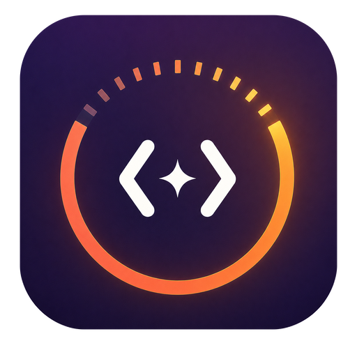

<div align="center">
  

  <h1>aftervibe</h1>

  <p><strong>Review the work behind the vibe.</strong><br>复盘你的 Vibe Coding。</p>

  <p>
    
    
    
    
    
  </p>

  <p>
    
    
    
    
    
  </p>

  <p>
    <a href="#chinese">🇨🇳 中文</a>
    ·
    <a href="#english">🇺🇸 English</a>
  </p>
</div>

---

<a id="chinese"></a>

## 🇨🇳 中文

aftervibe 是一款本机优先的 macOS 应用，用来整理和复盘 Coding Agent 的真实工作记录。它把零散的会话、工具调用、文件修改、测试与 Git 证据，转化为可追溯的用量分析、过程回放、工作复盘、长期洞察和分享卡片。

它不会替你启动或控制 Agent，也不会修改源码仓库。aftervibe 只读分析已经存在的本机记录，并在数据不足时明确显示“不可用”或“未记录”。

### ✨ 功能亮点

- 📊 **数据总览**：按今日、7 天、30 天、90 天、180 天和一年查看会话、Token、活跃时间、模型与工具分布。
- 🎬 **会话回放**：依据真实事件还原检查、编辑、测试、修复和验证过程。
- 🔎 **证据复盘**：把结论分为事实、推断和建议，每条结论尽量关联到具体证据。
- 🧬 **VCTI 人格**：根据一段时间内的真实协作行为生成 Vibe Coding 人格，不需要填写问卷。
- 🎨 **分享卡片**：通过确定性的 SVG 渲染管线导出 PNG、SVG，或直接复制图片。
- 💳 **Cursor 账户用量**：默认关闭；开启后可按当前时间范围查看 Dashboard Token 与成本，账户数据不会混入本机会话证据。
- 🌏 **中英双语**：界面和分享内容均支持简体中文与英文。

### 🤖 支持的数据源

aftervibe 会在本机查找以下工具的可读记录：

- Claude Code
- Codex
- Cursor
- Kimi Code
- OpenClaw
- Hermes

不同工具提供的数据字段并不相同，因此部分指标可能显示为“不可用”或“未记录”。所有适配器都遵循同一个原则：源目录只读，未知记录跳过，解析失败不输出原始私密内容。

### 🔐 隐私边界

- 🏠 索引数据库保存在 `~/Library/Application Support/com.aftervibe.desktop/aftervibe.sqlite`。
- 🚫 不保存源代码、完整 diff、终端输出、环境变量值、API Key 或完整模型回复。
- 🎛️ Git 读取、Prompt 结构分析和 Cursor Dashboard 用量均有独立开关。
- 🛡️ 分享内容会经过 Share Guard；项目名称、文件路径和自由文本默认不公开。
- 👀 深度复盘只发送确认页中列出的限长、脱敏 payload。

完整说明见 [隐私模型](docs/privacy.md)。

### 🧰 开发环境

- macOS 14 或更高版本
- Node.js 22 或更高版本
- Rust stable，包含 `rustfmt` 与 `clippy`
- Xcode Command Line Tools

### 🚀 开始开发

```sh
npm install
npm run dev
```

### 🧪 运行检查

```sh
npm run check
npm test
npm run check:rust
npm run test:rust
```

也可以一次运行全部检查：

```sh
npm run ci
```

### 🏗️ 构建 macOS 应用

```sh
npm run build
```

构建产物位于：

```text
apps/desktop/src-tauri/target/release/bundle/macos/aftervibe.app
```

### 🔑 可选环境变量

aftervibe 不会把 API Key 写入数据库。只有手动选择 API 深度复盘时，应用才会读取：

```text
OPENAI_API_KEY
ANTHROPIC_API_KEY
```

开发和导出测试还可使用：

```text
AFTERVIBE_TEST_DB
AFTERVIBE_PREVIEW_MENUBAR
AFTERVIBE_EXPORT_MATRIX_DIR
AFTERVIBE_EXPORT_TEMPLATE
```

### 🗂️ 项目结构

```text
apps/desktop/src/                 React 界面、状态、图表与本地化
apps/desktop/src-tauri/src/       Rust 数据适配、索引、复盘与导出
apps/desktop/src-tauri/tests/     Rust 集成测试
docs/                             架构与隐私说明
```

技术栈：Tauri 2、Rust、React、TypeScript、SQLite、ECharts。

### 🤝 参与贡献

提交代码前请阅读 [贡献指南](CONTRIBUTING.md)。涉及真实会话格式时，只能提交经过脱敏的最小 fixture，不要上传自己的完整记录、数据库或导出内容。

发现安全或隐私问题时，请按照 [安全策略](SECURITY.md) 私下报告，不要在公开 Issue 中附带敏感记录。

### 📄 License

项目采用 [MIT License](LICENSE)。

Space Grotesk 字体按其目录中的 [SIL Open Font License](apps/desktop/src/assets/fonts/OFL.txt) 分发。

aftervibe 与上述 Coding Agent 提供商没有隶属或背书关系。相关名称与商标归各自所有者。

---

<a id="english"></a>

## 🇺🇸 English

aftervibe is a local-first macOS app for understanding how you work with coding agents. It turns scattered sessions, tool calls, file changes, test activity, and Git evidence into traceable usage analytics, process replays, work reviews, long-term insights, and shareable cards.

aftervibe does not launch or control your agents, and it never modifies your source repositories. It reads existing local records in read-only mode and shows an explicit unavailable or unrecorded state whenever the evidence is incomplete.

### ✨ Highlights

- 📊 **Usage overview:** Explore sessions, tokens, active time, models, and tools across today, 7, 30, 90, 180, or 365 days.
- 🎬 **Session replay:** Reconstruct inspection, editing, testing, fixing, and verification from observed events.
- 🔎 **Evidence-backed reviews:** Separate facts, inferences, and suggestions, with links back to supporting evidence whenever possible.
- 🧬 **VCTI personality:** Generate a Vibe Coding personality from real collaboration patterns without completing a questionnaire.
- 🎨 **Share cards:** Export deterministic PNG and SVG cards, or copy a rendered image directly.
- 💳 **Cursor account usage:** Opt in to range-aware Dashboard token and cost reporting. Account-wide data stays separate from local session evidence.
- 🌏 **Bilingual UI:** Use the app and its share templates in Simplified Chinese or English.

### 🤖 Supported data sources

aftervibe looks for readable local records from:

- Claude Code
- Codex
- Cursor
- Kimi Code
- OpenClaw
- Hermes

Each tool exposes a different set of fields, so some metrics may be unavailable or unrecorded. Every adapter keeps source directories read-only, skips unknown records safely, and avoids exposing raw private payloads when parsing fails.

### 🔐 Privacy boundaries

- 🏠 The local index lives at `~/Library/Application Support/com.aftervibe.desktop/aftervibe.sqlite`.
- 🚫 aftervibe does not store source code, full diffs, terminal output, environment-variable values, API keys, or complete model responses.
- 🎛️ Git evidence, prompt-structure analysis, and Cursor Dashboard usage each have a separate switch.
- 🛡️ Share Guard checks exported content; project names, file paths, and free text remain hidden by default.
- 👀 Deep review sends only the bounded, sanitized payload shown on the confirmation screen.

See the full [privacy model](docs/privacy.md).

### 🧰 Requirements

- macOS 14 or later
- Node.js 22 or later
- Rust stable with `rustfmt` and `clippy`
- Xcode Command Line Tools

### 🚀 Start developing

```sh
npm install
npm run dev
```

### 🧪 Run checks

```sh
npm run check
npm test
npm run check:rust
npm run test:rust
```

Run the complete local CI sequence with:

```sh
npm run ci
```

### 🏗️ Build the macOS app

```sh
npm run build
```

The app bundle is written to:

```text
apps/desktop/src-tauri/target/release/bundle/macos/aftervibe.app
```

### 🔑 Optional environment variables

aftervibe never writes API keys to its database. It reads these variables only when you manually select an API-based deep review:

```text
OPENAI_API_KEY
ANTHROPIC_API_KEY
```

Development and export tests can also use:

```text
AFTERVIBE_TEST_DB
AFTERVIBE_PREVIEW_MENUBAR
AFTERVIBE_EXPORT_MATRIX_DIR
AFTERVIBE_EXPORT_TEMPLATE
```

### 🗂️ Repository layout

```text
apps/desktop/src/                 React UI, state, charts, and localization
apps/desktop/src-tauri/src/       Rust adapters, indexing, reviews, and exports
apps/desktop/src-tauri/tests/     Rust integration tests
docs/                             Architecture and privacy documentation
```

Stack: Tauri 2, Rust, React, TypeScript, SQLite, and ECharts.

### 🤝 Contributing

Read [CONTRIBUTING.md](CONTRIBUTING.md) before sending a change. If you need to demonstrate a real session format, commit only the smallest sanitized fixture. Never upload your complete records, database, or exports.

Report security and privacy issues privately by following [SECURITY.md](SECURITY.md). Do not attach sensitive records to a public issue.

### 📄 License

aftervibe is available under the [MIT License](LICENSE).

Space Grotesk is distributed under the [SIL Open Font License](apps/desktop/src/assets/fonts/OFL.txt) included with the font files.

aftervibe is not affiliated with or endorsed by the coding-agent providers named above. Their names and trademarks belong to their respective owners.
