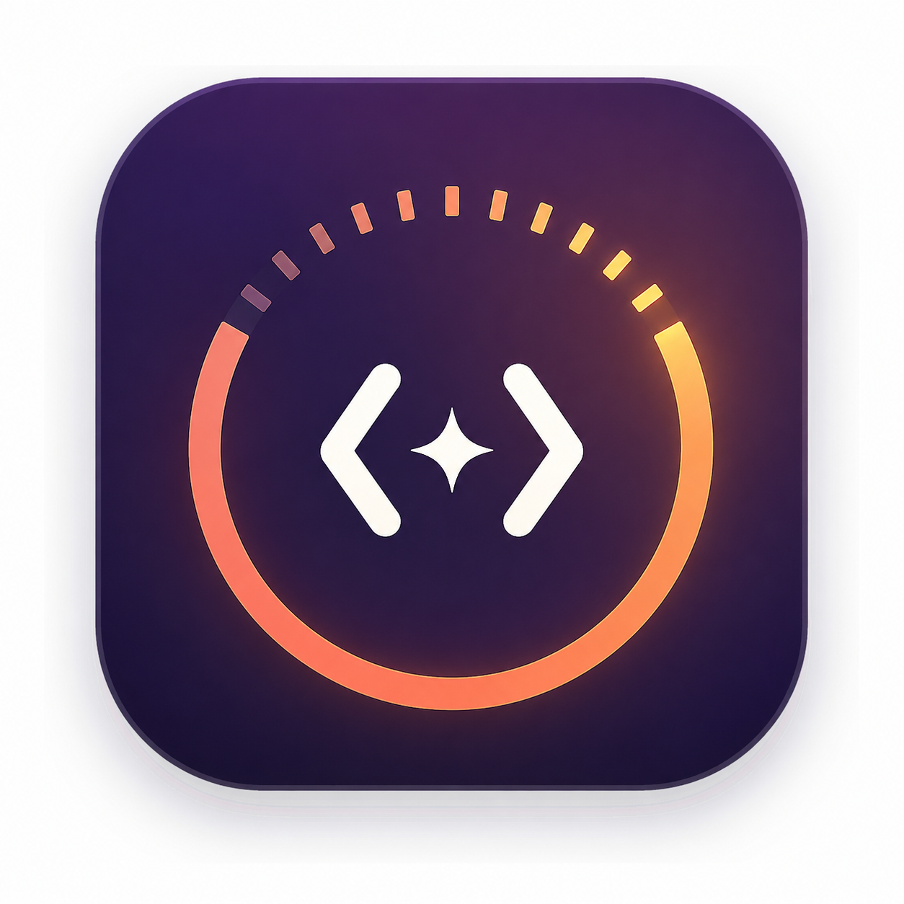

# VibeMeter

> Track your agents. Discover your coding type.<br>
> 追踪你的 Agent，发现你的 AI 编程人格。

[中文](README.md) · [English](README_EN.md)

VibeMeter 是一款本机优先的 macOS AI 编程活动追踪器。它在 MacBook Notch 与菜单栏里显示 Claude Code、Codex 的实时状态，把本机 Agent 会话整理成可验证的数据、回放与复盘，并从长期真实行为生成动态 VCTI 编程人格。



## 三个核心入口

- **Live**：在主界面、Notch 与菜单栏查看 Claude Code / Codex 的 `等待你处理 > 错误 > 运行中 > 已完成` 状态；可以跳回来源 App 或终端，但不会替用户批准权限、拒绝操作或发送 Prompt。
- **Data**：汇总会话、Token、时长、成本、Agent、模型、工具、活跃时间与工作事件；新增“我的口头禅”与“Agent 的口头禅”，词频来自本机真实会话，不调用 LLM 猜测。
- **VCTI**：使用本机可验证的行为信号生成 AI 编程人格、维度、置信度和证据；数据不足时明确显示不足，不强行判型。

会话回放、Aftervibe 复盘、洞察、分享、数据源和设置仍作为二级能力保留。Aftervibe 是会话结束后的证据型复盘功能，不再承担主品牌。

## 实时监看

首次完成引导时，VibeMeter 会为已安装的 Claude Code 与 Codex 自动配置本机 Hook：

- 安全合并现有 JSON / TOML 配置，不覆盖其他 Hook；
- 写入前创建带时间戳的备份；
- Hook 只把事件发送到权限为 `0600` 的本机 Unix socket；
- Notch 只显示 Agent、项目、阶段、状态与最近结构化动作，不显示原始 Prompt、命令或工具输出；
- 只有来源不在前台且进入“等待处理”或“错误”时才发系统通知，不播放声音；
- 设置页支持检查、修复和卸载；卸载只移除 VibeMeter 管理的条目。

Notch 与菜单栏可以分别关闭。不具备实体 Notch 的屏幕会诚实降级为菜单栏与主界面。首版实时状态只支持 Claude Code 和 Codex；Kimi Code、Cursor、OpenClaw 与 Hermes 仍可按本机可读取能力进入数据、回放和 VCTI。

## 口头禅

“我的口头禅”与“Agent 的口头禅”遵循同一套确定性规则：

- 中文短语 2–8 个字，英文短语 1–3 个词；
- 至少在多个会话重复出现才进入词云；
- 排除代码、文件路径、密钥形态、工具输出和停用词；
- 字号只编码出现频率；
- Agent 词语底色表示主要来源 Agent，并提供颜色图例与悬浮归因；
- 当前范围数据不足时显示明确的不足状态，不用 `0` 冒充“没有”。

分析在本机完成。历史会话只保存派生词频；实时 Hook 原始事件最多保留 90 天，长期仅保留 VCTI 所需的派生指标。

## 数据与隐私

- VibeMeter 只读扫描受支持的本机会话历史，不改写源会话或源码仓库。
- 独立数据库位于 `~/Library/Application Support/com.vibemeter.desktop/vibemeter.sqlite`。
- 首次启动会优先从 aftervibe 数据库复制，其次兼容旧 TokenGraph 数据库；复制使用 SQLite 在线备份，源数据库、WAL 与 SHM 不会被修改。
- Git 证据读取默认关闭；未授权、未记录与不可用会作为不同状态展示。
- 不保存完整 diff、终端环境变量、凭据或完整模型回复。
- 深度复盘只有在用户检查准确 payload 后才会调用本机 CLI 或 API。
- 分享导出统一经过 Share Guard；发现密钥或绝对路径时直接阻止导出。

完整边界见 [架构](docs/architecture.md)、[隐私模型](docs/privacy.md)与[迁移记录](docs/vibemeter-migration.md)。

## 分享

分享工作台目前公开 6 个模板：

| 分组 | 模板 |
| --- | --- |
| 数据 | Usage Overview、Developer Wrapped、Agent Comparison、Session Recap |
| 身份 | VCTI Identity Card、Catchphrases |

“Catchphrases”卡片同步包含“我的口头禅”与“Agent 的口头禅”、Agent 颜色图例和数据不足状态。所有公开模板支持简体中文 / 英文、浅色 / 深色、8 种画幅、PNG / SVG 与复制图片，并让预览和导出共用同一确定性渲染模型。

## 运行与构建

要求 macOS 14+、Node.js 22+、Rust stable 和 Xcode Command Line Tools：

```sh
npm install
npm run ci
npm run build
```

开发运行：

```sh
npm run dev
```

Tauri 产物位于：

```text
apps/desktop/src-tauri/target/release/bundle/macos/VibeMeter.app
```

本机交付副本位于 `release/VibeMeter.app`。当前构建为 Apple Silicon、ad-hoc 签名，未做 Apple notarization；实机与自动化记录见 [VALIDATION.md](VALIDATION.md)。

## 项目边界

- Bundle ID：`com.vibemeter.desktop`
- 数据库：`vibemeter.sqlite`
- 主品牌：`VibeMeter`
- 技术包名：`vibemeter`
- 许可证：MIT

实时集成参考了 [notchi](https://github.com/sk-ruban/notchi) 与 [VibeHub](https://github.com/mtunique/VibeHub) 的公开产品机制，但本仓库采用独立实现，没有复制其源码。notchi 为 GPL-3.0，VibeHub 为 Apache-2.0。
